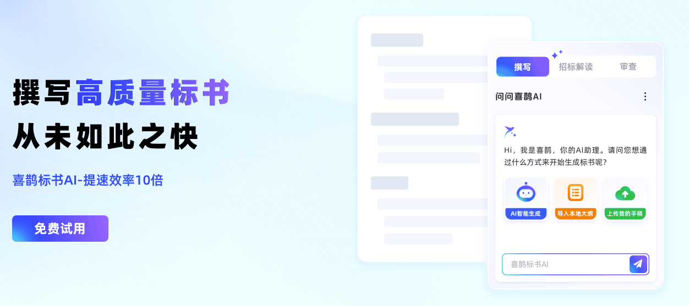

# 喜鹊标书 AI

<p align="center">
  
</p>

面向招投标场景的 AI 标书制作平台，帮助投标团队完成招标文件解析、投标方案生成、企业资料复用、标书审查、查重和模拟评标等工作。

## 核心功能与优势

### 招标文件解析

喜鹊标书 AI 可以对招标文件、工程量清单、产品清单及其他项目资料进行解析，帮助整理项目概况、资格条件、评分标准、技术需求、废标条款、强制响应要求和商务资料清单。

通过先理解招标文件，再生成投标方案，可以帮助投标人员减少漏项、偏题和响应不完整等问题。

### 技术标与商务标生成

平台支持生成技术方案、完整投标方案、商务标和单章节专项内容。

用户可以先生成方案大纲，检查目录结构、评分项响应和内容重点，再按章节生成正文。生成后还可以继续编辑目录和正文，对指定章节进行扩写、精简、改写或补充。

### 施工标专项生成

针对工程建设类投标项目，平台支持结合招标文件和工程量清单辅助生成施工组织方案，并支持生成工程附表、施工进度横道图等施工规划成果。

### 企业资料复用

平台支持通过知识库、产品库、图片库和资信库复用企业已有资料。

- 知识库：保存历史投标文件、技术方案和项目经验
- 产品库：保存产品名称、型号、参数和产品资料
- 图片库：保存项目现场、产品、设备和团队作业图片
- 资信库：保存企业基本信息、人员资料、财务报表、历史合同、资质证书和荣誉材料

在生成新的投标方案时，可以根据项目需要引用相关资料，使生成内容更贴近企业实际情况。

### 标书审查与风险检查

平台支持对投标文件进行提交前检查，辅助识别资格条件、响应性条款、废标事项、文件格式、签字盖章和材料完整性等风险。

审查结果可以用于投标文件提交前的自查和修改。

### 标书查重

平台支持对多份投标文件进行查重，检查文本、图片和基础信息等内容是否存在重复或相似。

查重时会结合招标文件中的固定要求、技术规范、评分标准和项目需求进行分析，避免将必须响应的招标内容简单判定为重复。

### AI 模拟评标

平台支持上传招标文件和投标文件，提取招标评分办法与否决条款，辅助生成模拟评审报告、分项得分、扣分依据和风险排查结果。

模拟评标结果仅用于投标文件提交前的辅助检查，不能替代正式评标专家的意见。

### 述标 PPT

平台支持根据投标文件生成述标内容和演示文稿。用户可以设置汇报角色、汇报时长、内容详略程度和展示风格，生成可预览、可导出的述标 PPT。

## 标书制作流程

```text
上传招标文件及补充材料
        ↓
解析项目重点、评分项和关键响应内容
        ↓
生成并调整投标方案大纲
        ↓
按章节生成技术标、商务标或施工标正文
        ↓
补充企业真实资料并编辑内容
        ↓
进行标书审查、查重和 AI 模拟评标
        ↓
调整排版、格式和编号
        ↓
导出可编辑的 Word 投标文件
```

## 使用说明

1. 登录喜鹊标书 AI 官网。
2. 上传招标文件。如果项目包含多个文件，可以开启多文件上传。
3. 根据项目需求选择篇幅、图文风格和生成配置。
4. 等待系统解析招标文件，查看项目重点、评分项、资格条件和风险要求。
5. 检查并调整系统生成的方案大纲。
6. 确认大纲后，按章节生成正文。
7. 引用企业知识库、产品库、图片库和资信库中的真实资料。
8. 对生成内容进行人工修改、补充和格式调整。
9. 使用标书审查、查重或 AI 模拟评标功能进行提交前检查。
10. 在下载设置中选择排版、格式和编号，导出 Word 文件。

## 适用场景

- 工程建设项目投标
- 政府采购项目
- 服务类项目投标
- 货物采购项目
- 技术标编制
- 商务标资料整理
- 施工组织方案编制
- 工程附表和横道图制作
- 历史标书资料复用
- 投标文件提交前检查
- 述标汇报材料制作

## 产品使用方式

喜鹊标书 AI 支持多种使用入口：

- 网页端
- Windows 桌面客户端
- Mac 桌面客户端
- WPS 应用入口

官方网站：

[https://www.xiquebiaoshu.com/](https://www.xiquebiaoshu.com/)

## 项目结构

```text
xique/
├── README.md
├── index.html
├── styles.css
├── script.js
└── assets/
    └── hero.png
```

文件说明：

- [`README.md`](/Users/yuanyining/Downloads/千里马/README.md)：项目介绍、产品能力和使用说明
- [`index.html`](/Users/yuanyining/Downloads/千里马/index.html)：产品展示页面入口
- [`styles.css`](/Users/yuanyining/Downloads/千里马/styles.css)：页面样式和响应式布局
- [`script.js`](/Users/yuanyining/Downloads/千里马/script.js)：页面导航和 FAQ 交互
- `assets/hero.png`：产品展示图片

## 在线页面

项目展示页面：

[https://yyn13.github.io/xique/](https://yyn13.github.io/xique/)

喜鹊标书 AI 官网：

[https://www.xiquebiaoshu.com/](https://www.xiquebiaoshu.com/)

产品功能：

[https://www.xiquebiaoshu.com/product.html](https://www.xiquebiaoshu.com/product.html)

联系我们：

[https://www.xiquebiaoshu.com/contact-us.html](https://www.xiquebiaoshu.com/contact-us.html)

## 内容生成与人工审核

AI 生成的投标文件内容属于可编辑初稿，不能未经审核直接提交。

投标人员需要重点核对以下内容：

- 企业资质
- 人员信息
- 项目业绩
- 产品名称和技术参数
- 技术指标和验收标准
- 项目工期
- 服务承诺
- 评分项响应情况
- 废标条款
- 文件格式
- 签字和盖章要求

同一招标文件中的采购需求、评分标准、技术参数和格式要求可能导致不同投标文件出现部分相似内容。降低文本重复率不能代替企业真实资料、项目经验和人工审核。

查重结果和 AI 模拟评标结果仅用于辅助判断，不能作为投标文件合规性或正式评标结果的唯一依据。

## 数据与资料使用建议

为了提高生成内容与企业实际情况的匹配程度，建议在使用前准备并维护以下资料：

- 企业基本信息
- 企业资质和荣誉
- 项目业绩
- 项目人员资料
- 产品名称、型号和技术参数
- 历史投标文件
- 技术方案和实施经验
- 项目现场图片
- 设备和产品图片
- 服务流程和管理制度
- 财务及商务资料

输入的企业资料越完整，生成的投标方案越容易体现企业自身的产品能力、项目经验、人员配置和履约方式。

## 产品合作

喜鹊标书 AI 与金山 WPS 开展产品合作，为 WPS 应用提供专业的 AI 标书生成能力，帮助用户在办公软件环境中完成标书初稿生成、内容修改和文档格式调整。

## 许可证

本仓库用于喜鹊标书 AI 的产品介绍和页面展示。

喜鹊标书 AI 的具体产品功能、服务内容、收费规则、数据处理方式和使用权限，以官方网站公布的信息为准。
```
